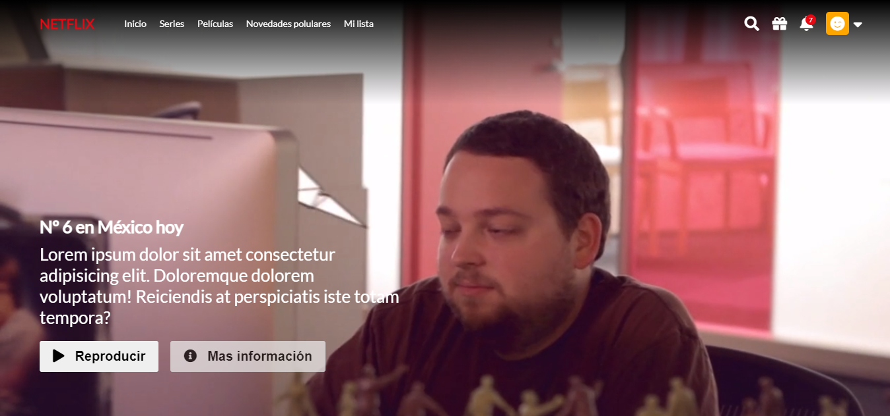

# Netflix clone 📺

This is a clone of a popular streaming platform for videos.

Site: [https://iscasur.github.io/netflix-clone/](https://iscasur.github.io/netflix-clone/)



## Getting started 🚀

If you want to run this project locally, you can:

1. Clone this project

```bash
git clone https://github.com/iscasur/netflix-clone

```

2. Go to the project's folder

```bash
cd netflix-clone
```

3. Install

```bash
npm install
```

4. Run development enviroment

```bash
npm run dev
```

## Contributing ⚙

If you want to contribute with this project, just make a Pull Request explaning the improving/fixing.

## Technologies 💎

- Pug
- SASS
- JavaScript

## License 📃

This proyect is MIT licensed
